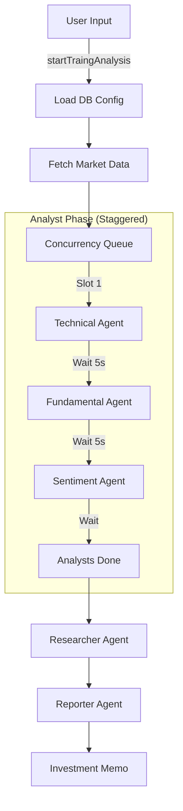

# US Finance & Stock Market RSS Aggregator

A modern, responsive web application aggregating financial news and stock market data from various sources.

## Features

- **RSS Aggregation**: Real-time news from CNBC, MarketWatch, WSJ, and more.
- **Market Overview**: Interactive charts and heatmaps powered by TradingView.
- **Stock Search**: Global stock search using Finnhub API.
- **Stock Details**: Comprehensive stock data, charts, and company profiles.
- **Modern UI**: Fintech-inspired design with Dark Mode support.

## Tech Stack

- **Framework**: Next.js 15 (App Router)
- **Language**: TypeScript
- **Styling**: Tailwind CSS v4, Framer Motion
- **Data**: RSS Parser, Finnhub API
- **Components**: shadcn/ui (adapted), Lucide React

## Getting Started

1.  **Clone the repository**:
    ```bash
    git clone https://github.com/your-username/us-finance-rss.git
    cd us-finance-rss
    ```

2.  **Install dependencies**:
    ```bash
    npm install
    ```

3.  **Configure Environment Variables**:
    Create a `.env.local` file in the root directory and add your Finnhub API key:
    ```env
    NEXT_PUBLIC_FINNHUB_API_KEY=your_finnhub_api_key_here
    FINNHUB_API_KEY=your_finnhub_api_key_here
    ```

4.  **Run the development server**:
    ```bash
    npm run dev
    ```

5.  Open [http://localhost:3000](http://localhost:3000) with your browser.

## License & Credits

This project is licensed under the **AGPL-3.0 License**.

### OpenStock Integration
This project incorporates features and code from [OpenStock](https://github.com/Open-Dev-Society/OpenStock), which is licensed under AGPL-3.0.
- **Stock Search & Details**: Adapted from OpenStock's implementation.
- **TradingView Widgets**: Integrated from OpenStock's component library.
- **UI Components**: Selected components adapted from OpenStock (shadcn/ui based).

We thank the OpenStock contributors for their open-source work.

## AI Agent Workflow

The system uses a multi-agent orchestration logic to analyze financial data:

1.  **Configuration Load**: Fetches dynamic settings from the PostgreSQL database.
2.  **Data Gathering**: Fetches real-time data from Finnhub (Price, News, Fundamentals).
3.  **Analyst Execution**: Runs 3 specialized agents (Technical, Fundamental, Sentiment) in a staggered queue to respect rate limits.
4.  **Synthesis**: Runs the Researcher agent to debate the findings.
5.  **Reporting**: Runs the Reporter agent to generate the final memo.

### Visual Flow



<!-- Trigger Vercel Deploy: 2025-12-03 17:54:31 -->
