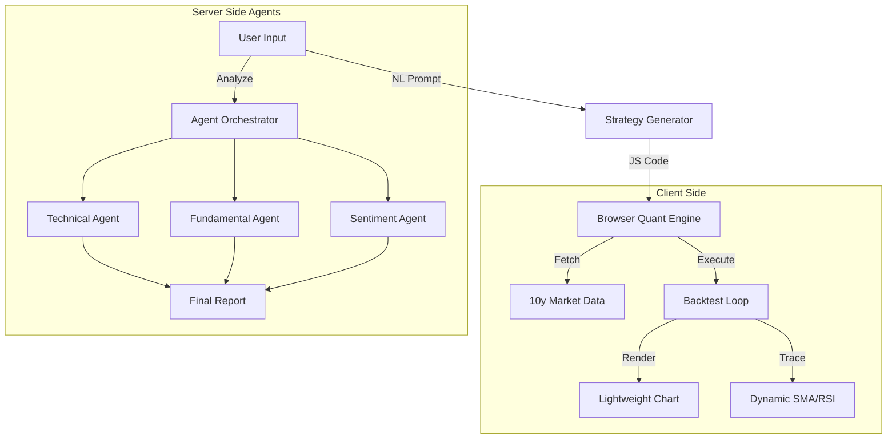

# Multi-Agents Stock Intelligent Analysis & Automated Quantitative Strategy

A modern, high-performance financial intelligence platform that leverages **Multi-Agent AI** for deep stock analysis and **Automated Logic Engines** for quantitative strategy generation and backtesting.

## Key Features

### 🧠 Multi-Agent Stock Analysis
- **Technical Analyst**: Analyzes charts, RSI, MACD, and price action.
- **Fundamental Analyst**: Reviews earnings, P/E ratios, and balance sheets.
- **Sentiment Analyst**: Scans news and market sentiment.
- **Researcher & Reporter**: Synthesizes conflicting data into a cohesive investment memo.
- **Orchestration**: Staggered execution with DB-backed concurrency management.

### ⚡ Automated Quantitative Strategy
- **Natural Language to Code**: Type "Buy when RSI < 30" and get executable Strategy Code instantly.
- **Client-Side Engine**: Strategies run 100% locally in the browser for privacy and speed.
- **Backtesting & Verification**:
  - **10-Year Historical Data**: Instant validation against long-term SPX/Stock history.
  - **Dynamic Tracing**: Auto-plots custom indicators (SMA, RSI, BB) on the chart.
  - **Interactive Charting**: Visual Buy/Sell markers and P&L analysis.

### 📊 Market Intelligence
- **Real-time News**: Aggregated from major financial outlets via RSS.
- **Global Stock Search**: Powered by Finnhub.
- **Professional UI**: Fintech-grade design with glassmorphism and data visualization.

---

## Getting Started

### 1. Installation

```bash
git clone https://github.com/your-username/us-finance-rss.git
cd us-finance-rss
npm install
```

### 2. Environment Configuration

Create a `.env.local` file in the root directory. This project requires several API keys to function fully.

#### Required Keys

| Variable | Description | Where to get it |
| :--- | :--- | :--- |
| `FINNHUB_API_KEY` | **Core Market Data**. Used for real-time stock prices and profiles. | [Finnhub.io](https://finnhub.io/) |
| `NEXT_PUBLIC_FINNHUB_API_KEY` | Public key for client-side widgets. Same as above. | [Finnhub.io](https://finnhub.io/) |
| `DATABASE_URL` | **PostgreSQL Connection**. Used for system settings and agent concurrency locks. | [Neon / Supabase](https://neon.tech) |

#### AI Provider Keys (At least one required)

| Variable | Description | Where to get it |
| :--- | :--- | :--- |
| `POLLINATIONS_API_KEY` | **Primary AI**. Free tier available. Used for fast text generation. | [Pollinations.ai](https://pollinations.ai/) |
| `POIXE_API_KEY` | **Fallback AI**. Optimized for lower latency. | [Poixe](https://poixe.com) |
| `OPENROUTER_API_KEY` | **Premium AI**. Access to GPT-4, Claude 3, etc. | [OpenRouter](https://openrouter.ai) |

#### Optional Extensions

| Variable | Description | Usage |
| :--- | :--- | :--- |
| `GOOGLE_PRIVATE_KEY` | **Google Service Account Key**. For syncing data to Sheets. | Google Cloud Console |
| `GOOGLE_SERVICE_ACCOUNT_EMAIL` | Service Account Email Address. | Google Cloud Console |
| `NEXT_PUBLIC_GOOGLE_SHEET_ID` | The ID of the Google Sheet to write data to. | Browser URL of your Sheet |
| `NEXT_PUBLIC_GOOGLE_SHEET_GID` | The Grid ID (Tab ID) of the specific sheet. | Browser URL (`gid=0`) |
| `CRON_SECRET` | Secret to protect scheduled cron jobs. | Generate a random string |

### 3. Running the App

```bash
npm run dev
```
Open [http://localhost:3000](http://localhost:3000) to view the dashboard.

---

## Architecture



## License

This project is licensed under the **AGPL-3.0 License**.

incorporates features from [OpenStock](https://github.com/Open-Dev-Society/OpenStock).
