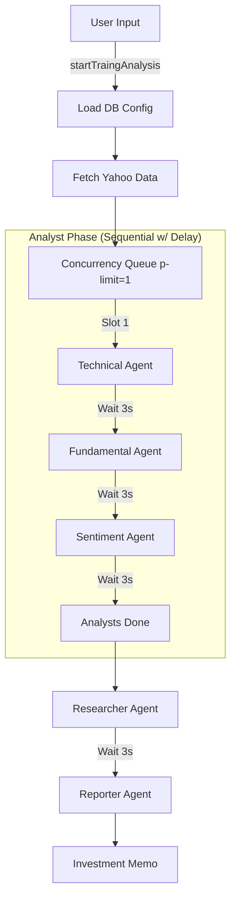

# Agent Flow & API Execution Logic

This document outlines the orchestration logic for the `AiAgents` system, specifically how it manages concurrency and rate limits for the Pollinations API.

## 1. High-Level Workflow
When a user requests an analysis for a ticker (e.g., "NVDA"), the `startTradingAnalysis` server action coordinates the following steps:

1.  **Configuration Load**: Fetches dynamic settings (Concurrency Limit, Interval) from the PostgreSQL database (`system_settings` table).
2.  **Data Gathering**: Fetches real-time data from Yahoo Finance (Price, News, Fundamentals).
3.  **Analyst Execution**: Runs 3 specialized agents (Technical, Fundamental, Sentiment). **These are rate-limited.**
4.  **Synthesis**: Runs the Researcher agent to debate the findings.
5.  **Reporting**: Runs the Reporter agent to generate the final memo.

## 2. API Concurrency & Rate Limiting
To avoid "Too Many Requests" errors from the Pollinations API, we implement a strict **Queue + Delay** mechanism.

### Key Components
-   **`p-limit`**: A queue manager that restricts how many API calls can be "in-flight" at once.
-   **`system_settings` DB Table**: Stores the configuration.
    -   `pollinations_concurrency`: Max parallel requests (Default: `1`).
    -   `pollinations_interval`: Cooldown delay in seconds between requests (Default: `3`).

### Execution Logic (`src/lib/agents/concurrency.ts`)

When `startTradingAnalysis` is called:

1.  **Update Limiter**:
    -   The system queries the DB for `pollinations_concurrency` and `pollinations_interval`.
    -   It updates the in-memory queue manager (`p-limit`) match the new concurrency limit.
    -   It updates the global `currentInterval` variable (converting seconds to milliseconds).

2.  **Wrapped Execution**:
    -   Every call to the LLM (`runAgentAnalysis`) is wrapped in `withConcurrencyLimit()`.
    -   **Step A (Queue)**: The request waits in the queue until a slot is free (e.g., if Limit=1, it waits for the previous one to finish).
    -   **Step B (API Call)**: The request executes the Pollinations API call.
    -   **Step C (Cool-down)**: *After* the call returns, the system pauses for `currentInterval` ms (e.g., 3000ms).
    -   **Step D (Release)**: Only after the pause is the slot released for the next task in the queue.

## 3. Visual Flow



## 4. Database Configuration
You can adjust the speed dynamically via SQL without redeploying:

```sql
-- Make it faster (Risk of 429 Errors)
UPDATE system_settings SET value = '0' WHERE key = 'pollinations_interval';

-- Make it safer (Slower)
UPDATE system_settings SET value = '5' WHERE key = 'pollinations_interval';
```
